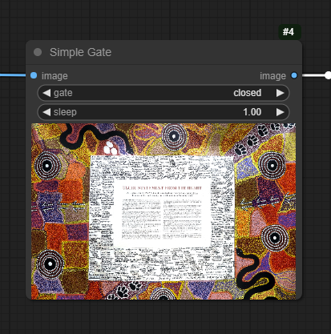

# Simple Gate
 
Love this node? [Buy me a coffee!](https://www.buymeacoffee.com/chrisgoringe)

A node that either stops the workflow or passes an image straight through. Based on an idea from [RexLeeGrey](https://github.com/RexLeeGrey) for use in live painting (see the [discussion](https://github.com/chrisgoringe/cg-image-picker/issues/97))

Shameless plug for my other work:
- choose which of several images to pass on to the next stage - [Image Picker](https://github.com/chrisgoringe/cg-image-picker)
- want to make your workflow cleaner - check out [UE Nodes](https://github.com/chrisgoringe/cg-use-everywhere)

## Installing, updating, removing

To install - in your `custom_nodes` directory, `git clone github.com/chrisgoringe/cg-simple-gate`

To update - in `custom_nodes/cg-simple-gate`, `git pull`

To remove - delete the directory `cg-simple-gate` from your `custom_nodes` directory

## Usage

Simple gate acts like an image preview node which also, optionally, passes the image through.

The gate has three settings, and an optional sleep.

- `closed` sleep for x seconds, then cancel the workflow
- `open` sleep for x seconds, then pass the image through, and set the gate to `closed`
- `held open` sleep for x seconds, then pass the image through, and remain `held open`

The `sleep` has two purposes. It can prevent you from spamming the backend with restarts when the upstream workflow is very quick.
It can also be used to allow you to choose to pass an image through (or block it) when you see it. If you change the gate setting during the pause, the node will use the new setting. So, for instance, if you set the sleep to 5, then when the image preview appears you have 5 seconds in which you can decide to open or to close the gate.

## That's it

Issues or ideas? [post them here](https://github.com/chrisgoringe/cg-simple-gate/issues)